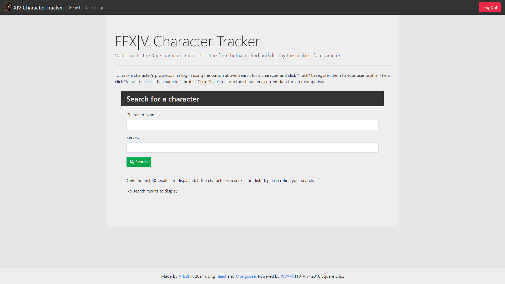

# xiv-character-tracker

## About
This is a FFXIV fan web app to track character progress. It is built in MERN / MVC format - using Express for routing, MongoDB Atlas / Mongoose for data storage, React for pages and Node for backend. The Mongo database has two collections. The Character dataset includes ID, name, server, avatar portrait URL, minion and mount counts, and class levels. The User dataset contains user IDs and an array of character IDs. External data is obtained via the [XIVAPI-js](https://www.npmjs.com/package/@xivapi/js) NPM package.

## Usage
Upon loading the webapp, visitors may log in via the login button in the top right, which uses the Auth0 srvice for authentication and includes Google and Discord social connections. Users are initially presented with a page giving instruction on use, as well as a form for searching for an existing character by name and server. This search form can also be accessed via the "Search" link in the header menu. In the results list, the "View" button will lead to a character sheet detailing the specified character's information, which, like the list of search results, is taken from the [Final Fantasy XIV Official Website](https://eu.finalfantasyxiv.com/lodestone/) via the [XIVAPI](https://xivapi.com) API. If no character data can be obtained from either external or internal data stores, "Unbale to Retrieve" is displayed. If a character's data was previously saved to the database and has since had changes \(i.e. an increase in class level, experience points, or number of minions or mounts\), the difference will be highlighted in green, e.g. "+10".

If a user is logged in, a "Track" button is visible on the search result list. Clicking this button adds the character's ID to the User's database record. For character data to be associated with the user, they must then click "View" to load the character's information and click "Save current stats" to copy the character data into the Character database. The user can then visit the User Page, which will list any characters currently associated with them, provided the Character database has an entry associated with that ID. From the User page, the "View" button will load the character sheet, while the "Untrack" button will remove the relevant character ID from the user's entry in the User database.

## Visiting the webapp
The webapp is deployed on Heroku at the following URL:

(https://lit-caverns-46124.herokuapp.com/)

## Preview
